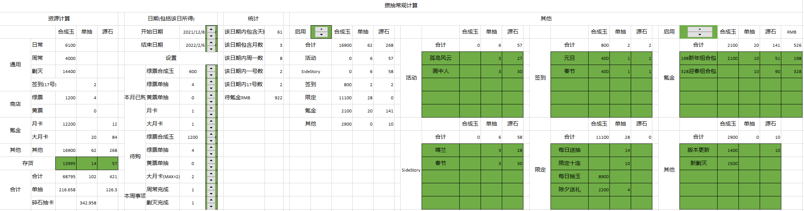

# Arknights_Tools

## Excel

### Arknights Resource Calculator

明日方舟资源计算器

#### v1.0

完成抽卡资源基础功能，可通过日期变换以及其他设置综合计算得出未来可获取资源，并得出碎石后抽卡次数，可以深刻认识到周年前能攒多少抽，从而避免周年时因攒抽不够导致的648×N（脸黑另说

待解决问题：

1. 因为我月卡是一直续着的，所以该表默认月卡的每日200合成玉一直存在，本月已购中的月卡代表的是这个月月卡的6个源石，且在计算中未来的每月都会加上月卡的6源石。
2. 改变日期、周常剿灭完成状态或故事集等内容的话只会影响未来资源计算，即需要手动更改存货数量。所以每次查看可能都需要根据当前账号情况手动修改存货、日期和设置内容，以及其他中已获取内容。
3. 氪金类是作为其他类的子类而存在的，即其他类不启用而氪金类启用的话是不会改变资源计算的值的，氪金类通过影响其他类的值来影响计算总值。
4. 开始日期和结束日期都默认这天日常没做月卡没领，但如果是周日日常做完但周常剿灭没完成的话，开始日期需要调到下周一才能舍去这周日的日常合成玉，但这样就会导致这周的周常剿灭被忽略，直接认为这周周常剿灭是不可获取值，不计入未来可获取资源中。不过，不会真的有人准备攒抽周日还没领到周常的500合成玉或者打完剿灭吧不会吧不会吧不会吧。
5. 所有的数值调节钮都是通过改变按钮下方单元格的值来改变其左侧的值，所以对于待购这种需要动态最大值的变量就会出问题，数值调节钮的最大值只能设置成一个具体的数，所以只能通过在按钮左侧单元格中加入判定来保证最大值，但这样就会导致在达到最大值后继续按增大按钮时，按钮下单元格的值仍在不断增大，而左侧单元格值并不会变化，在减小时就需要先把按钮下单元格的值先减小到应该的最大值后继续减小才能使得左侧单元格的值变化。即在达到最大值后多按了5遍增大按钮，那么需要按5遍减小按钮之后再按减小按钮左侧单元格的值才会变化。
6. 黄票单抽按钮下单元格的值为兑换次数而不是抽数，但其需要将一个月的38抽全部换完才会计算下个月的，即当按钮下单元格的值为5的时候左侧数值为38，为6时左侧数值为39，这样就无法计算下面几个月不换完的情况，且当本月换一半时，待购的黄票计算是从下个月开始的，本月剩余未兑换的是留在待购黄票计算的最后展现的，即只有当待购黄票最大值拉满的时候，才能包括本月没有兑换完的黄票。出现这个问题的时候暂时建议撤销工作表保护然后手动修改待购黄票单抽的值来解决。
7. 最大！最重要！的一个问题！就是！我！懒得！改！...（理直气壮

备注：

1. 本月已购中的各种数值不会影响资源计算，只会改变待购的可购最大值，即这个月已经清空绿票商店的话，在待购的可购最大值就会对应的少去这个月的值。
2. 不想按按钮慢慢调的话可以直接修改按钮下方单元格的值来快速修改。其中日期按钮下单元格的值是excel中日期的序列号减去40000的值，黄票单抽的按钮下单元格的值均为兑换次数而不是抽数。

#### v1.1

加入材料资源计算功能，开发中...

开发进度：

- [ ] 存货功能实现
  - [x] 基础框架搭建
  - [ ] 数据自动计算实现
  - [ ] 按钮控件实现
- [ ] 合成功能实现
  - [x] 基础框架搭建
  - [ ] 数据自动计算实现
  - [ ] 按钮控件实现
- [ ] 企鹅物流数据读取
- [ ] 加入干员精英化以及专精等计算，并加入狗粮等计算，进入v1.2版本

#### v1.2

加入理智计算功能以及个人自用基建排班
